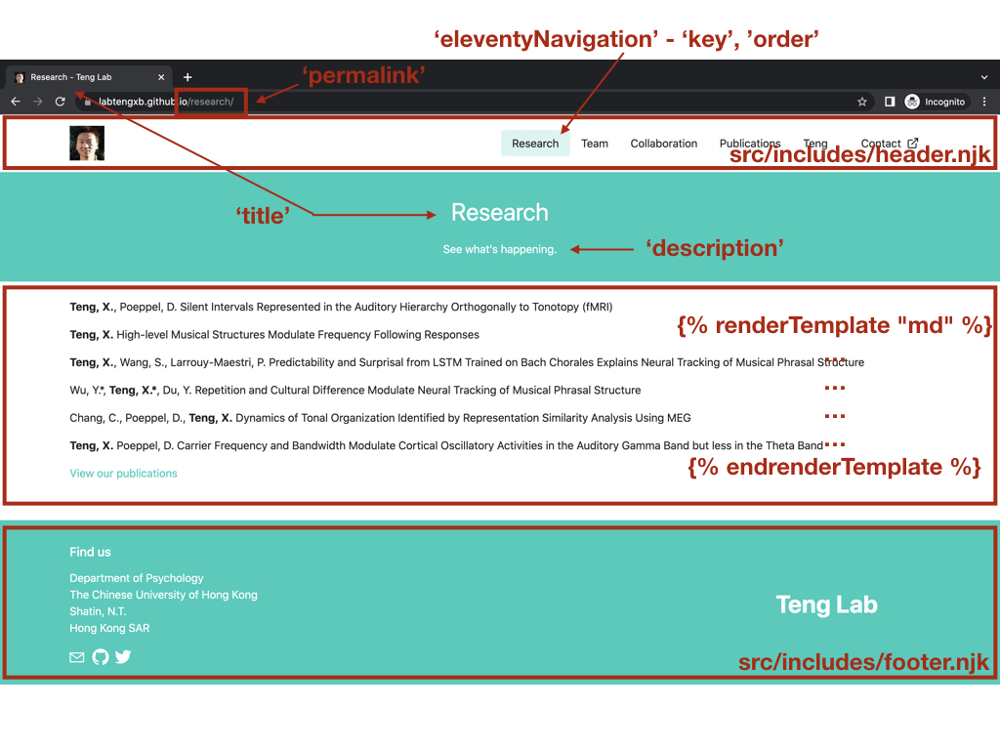

# Teng lab

Teng Lab focuses on understanding how human beings understand speech and appreciate music. 
This is the source code that sets up the lab's static website on https://labtengxb.github.io/.

## Overview

This project uses:
- [Eleventy](https://www.11ty.dev/) to generate static files, packing with [Fylgja CSS](https://fylgja.dev/)
- [Github Actions](https://github.com/features/actions) to build the source and publish
- [GitHub Pages](https://pages.github.com/) to host the site

## Quickstart

Assume you have basic Git, HTML, CSS and Javascript skills and have Git, Node.js and npm on your computer.

1. Clone this repository.
2. Get into the directory.
3. npm install the dependencies.
4. Start a local server. Now you can modify the code and see your change locally.

```
$ git clone https://github.com/labtengxb/labtengxb.github.io.git
$ cd labtengxb.github.io
$ npm install
$ npm start
```

## Cheatsheet

In brief, for each change, there’re 3 things to do: update, build then publish.

### Update

The `src` folder is where you update most of the contents.

Files ending with `.njk` are written in [Nunjucks](https://www.11ty.dev/docs/languages/nunjucks/).
The `.njk` files are named based on the content, for instance,
* `publications.njk` refer to the `Publications` page
* `team.njk` refers to the `Team` page

Assume you want to edit the `Research` page. You just need to open `research.njk` then edit the corresponding fields:



This method is applicable to most of the files. But if you want to update pages for team members or collaborators it's a bit different. 
Assume you want to add a collaborator, here's a simple way for reference:
1. Get into the `collaborators` folder.
2. Create a file from an existing`.md` file for the new collaborator. 
3. Edit the file. `date` decides the collaborator order on the `Collaborators` page. You can find all the avatars in `photos`.

### Build and publish

Git commit and push the updates to the `main` branch when you get the updates done. 
Then Github Actions will help with build (`.github/workflows/build.yml`) and publish. 
You can find the progress in the Github dashboard: https://github.com/labtengxb/labtengxb.github.io/actions

You should be able to see your updates online once it's been finished. 

## TODO
- [] confirm lab domain
